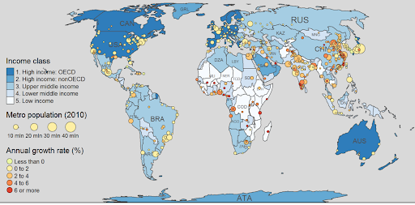

##  Polishing the visualizations and tables

The gallery at https://gallery.htmlwidgets.org/ provided us with several ideas that helped us improve our visualizations and tables.

To begin, we want at least three different maps to start out with from the BLOG6 interactive concepts. On the other hand, we can simply combine the information from three maps, as seen in the example map below.

```{r}

```

Still, we have the option of coloring the average income of each state according to its level. States with higher average salaries will have darker colors, and states with lower average incomes will have lighter colors. The next step is to turn the annual revenue growth rate into a diagram consisting of a sequence of colored circles with various places. and using a variety of sized dots to illustrate the percentage of students who graduate from college.

